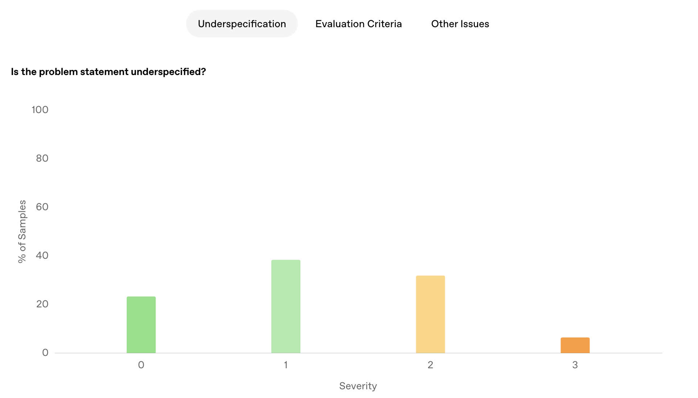

# Introducing SWE-bench Verified
https://openai.com/index/introducing-swe-bench-verified/ (Updated Feb. 4 2025)

## SWE-bench
Evaluates LLMs' abilities to produce real-world software solutions from GitHub.
FAIL_TO_PASS designates when the unit tests pass only after the solution code in the pull request (PR) is added
PASS_TO_PASS designates unit tests that pass once more after the solution code from the PR is added, thereby preserving previous functionality
Both sets of tests must pass for the edit to completely resolve the original GitHub issue

## Areas of Improvement for SWE-bench
1. Unit tests are overly specific and/or unrelated to the issue, resulting in correct solutions being rejected
2. Samples may have underspecified issue descriptions, so there is ambiguity on the nature of the problem and a potential solution
3. Reliability of setting up SWE-bench dev environments for agents, so unit tests fail inadvertently meaning valid solutions may be marked as inaccurate

Ex. scikit-learn repo issue has a vague problem statement and the agent does not have access to the DeprecationWarning; there is a lack of visibility into the tests that the agent must pass

## SWE-bench Verified
500 samples verified to be non-problematic by human annotators
'easy' subset contains 196 fix tasks (duration below 15 minutes), 'hard' subset 45 fix tasks (duration > 1 hour)

OpenAI's GPT-4o resolves 33.2% of samples, with the open-source scaffold, Agentless, doubling its previous score of 16% on SWE-bench

# Approach
Annotated 1699 random samples from SWE-bench test to create SWE-bench Verified
Sample Annotation
*Whether issue description is underspecified and unfair to test on
*Whether FAIL_TO_PASS unit tests filter out valid solutions (false negatives)

# Annotation Criteria
1. Are tasks well-specified? (0 -> 4; well-specified and high clarity of a successful solution -> nearly impossible to understand what you are asked to do without additional info)
2. How valid are the evaluation criteria? (0 -> 4; tests perfectly cover every possible solution -> tests are too narrow/broad or consider something else than the true nature of the issue)
3. How difficult are the tasks? (0 to 4, <15 minutes fix,->  >4 hours fix) 

Dataset construction
*Filter out sample from original test set if problem statement of FAIL_TO_PASS unit tests have an ensemble label of 2 or higher in severity
*Filter out samples that have other major issues flagged; equivalent to removing a sample in which any single annotator out of three has flagged an issue with the sample
#Include many samples with diff. 1-4 hours and >4 hours as possible, and randomly sample remainder to reach 500 samples for SWE-bench Verified

<figure>
  
  <figcaption>Figure 2: Annotation Results of SWE-bench Verified</figcaption>
</figure>
Takeaways
*38.3% of samples flagged for underspecified problem statements
*61.1% of samples flagged for unit tests that may ufairly mark valid solutions as incorrect
*Fewer than 10% of issues estimated to take longer than an hour

Performance stratified by difficulty on SWE-bench Verified versus 231 random samples of SWE-bench versus 1699 random samples of SWE-bench
*GPT-4o performance on SWE-bench Verified doubles its score from the original SWE-bench
*Performance increases within individual difficulty categories when moving to SWE-bench Verified, which matches expectation of removing impossible samples from all categories

# Dicussions and Limitations
1. Invest in deeply understanding OpenAI's benchmarks (high level of expertise and care required to curate and verify benchmarks to ensure that they are sufficiently challenging and robust)
2. Account for progress in the ecosystem (GPT-4's performance on SWE-bench Lite varies between 2.7% using an early RAG-based scaffold and 28.3% using CodeR)
Evaluations need to be run continaully for identifing non-trivial capability change; from before, during, and after training. Researcher collaboration on buildling evaluations reveals the ecosystem-wide effort to curate evals.

