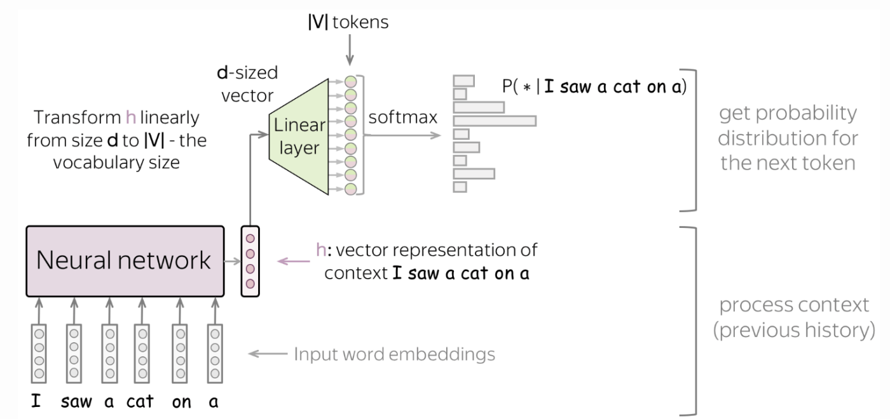

# Introduction to training LLMs for AI agents
Repo containing unrevised (work-in-progress) notes of various papers relating to LLMs and Agents.

#Pretraining, Postraining, Reasoning RL and Classic post-training / RLHF
Pretrain: Predict next work on internet,
Reasoning RL: Think on questions with objective answers
RLHF: Max user utility & prefs
Second and third stages may be bundled together and collectively referred to as post-training.

# LLM training pipeline
Architecture, Training algorithm/loss, Data & RL env, Evaluation, Systems and infra to scale
Data, Evals, and Systems are what matter in practice.

#LLM specializing pipeline
Prompting: Art of asking the model what you want
Finetuning: Second stage of postraining to domain specific data

Pretraining: Goal -> teach the model everything in the world
Task -> predict the next word
Data -> any reasonable data on internet
Since GPT-2 (2019), pretraining has been key

AR Language Models
Steps -> 
1. tokenize {She} {likely} {prefers} 
2. forward pass 
3. predict probability of next token
4. sample (What exactly does this entail?)
5. detokenize

Simple Language Model: N-grams (non-parametric estimator)
Forward pass -> predict the distribution
Stats: Take all occurrences of {the grass is} on Wikipedia
Predicted probability for X is
P(x| {the grass is}) = Count(X | {the grass is}) / Count({the grass is})
Issues: 1. Need to keep count of all occurrences for each n-gram (Huge Memory Overhead)
2. Most sentences are unique: this can't generalize

Solution: neural networks (approximate prediction using parametric estimator)

#Neural Language Models
Split (I saw a cat on a ) into five input word embeddings {I}, {saw}, ...
Use non-linear aggregator of these vectors

A very simple neural network could just be an average of this.

